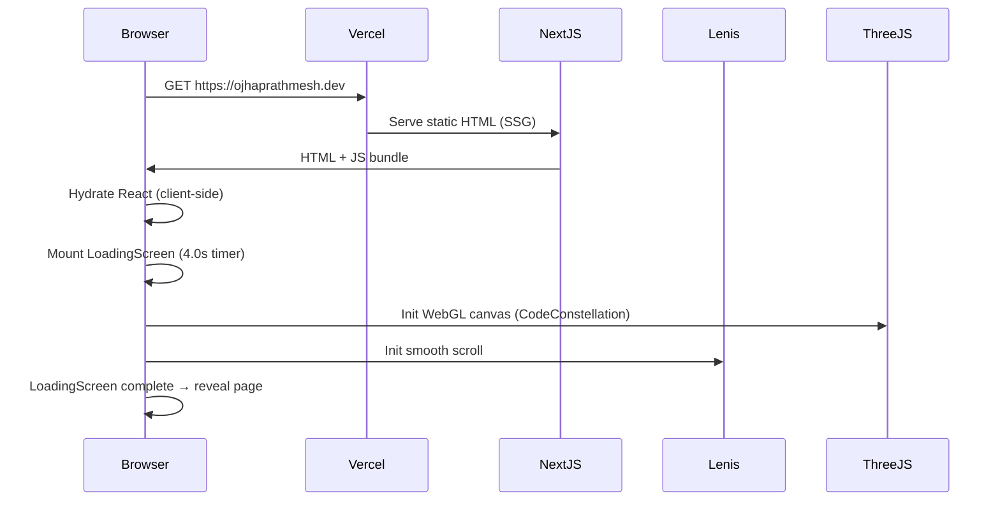
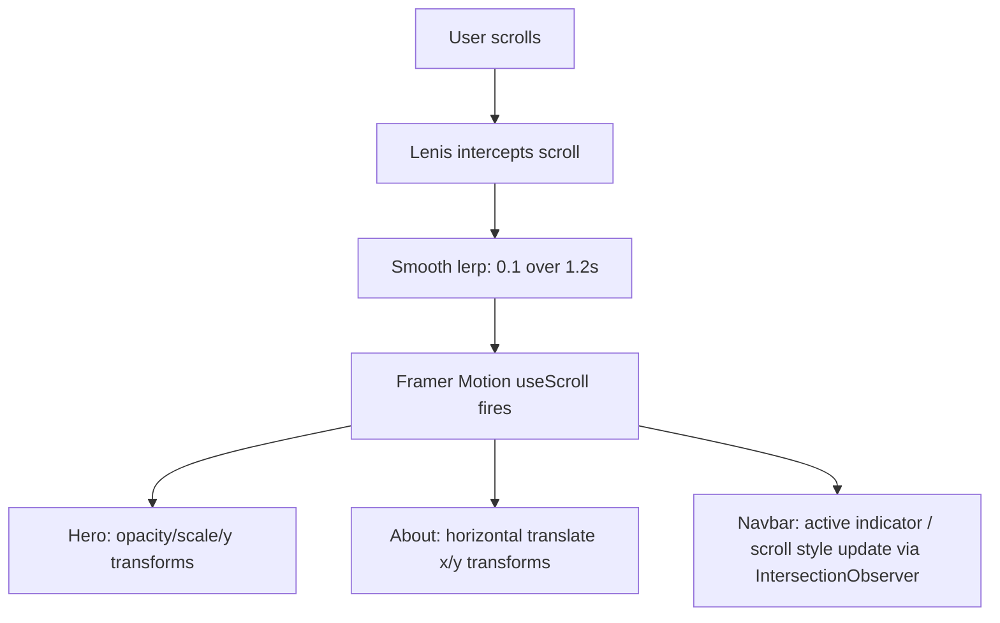
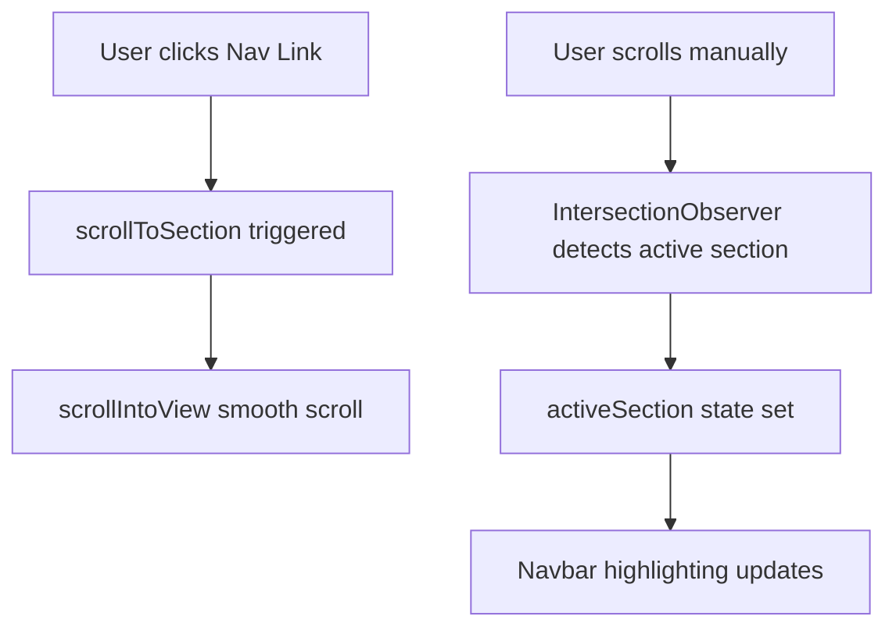
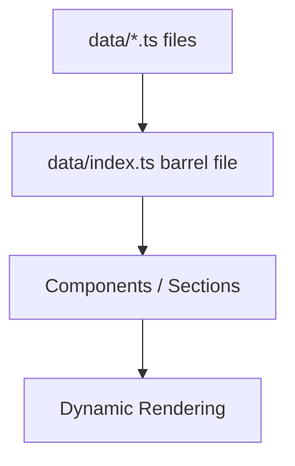

# PROJECT_CONTEXT

> **Last Updated:** 2026-05-22 | **Source of Truth:** Generated by full codebase analysis — no guessing.
> This document is intended as a permanent reference for AI agents, developers, and reviewers.

---

## 1. Project Overview

| Field | Detail |
|---|---|
| **Project Name** | Prathmesh Ojha — Personal Portfolio |
| **Owner** | Prathmesh Ojha (`@ojhaprathmesh`) |
| **Purpose** | A visually premium personal portfolio website for a B.Tech CSE (Data Science & AI) student and full-stack developer |
| **Target Users** | Recruiters, hiring managers, collaborators, and open-source peers |
| **Live URL** | `https://ojhaprathmesh.in` (configured in `data/site.ts`) |
| **Current Phase** | Active Development — single-page portfolio, no backend |
| **Architectural Style** | Static single-page application (SPA) with client-side animation |

### Core Features (implemented)
- Animated loading screen with blueprint SVG + progress bar
- Full-screen 3D code constellation hero background (Three.js / React Three Fiber)
- Framer Motion parallax scroll effects
- Lenis smooth-scroll with momentum physics
- Custom mix-blend-difference cursor
- Animated navbar with mobile overlay
- Horizontal scroll "stream of consciousness" about section
- Project gallery with magnetic mouse-tracking hover images
- Dual-row CSS marquee for tech stack and concepts
- Live clock footer with email CTA
- Vercel Analytics integration
- Full SEO metadata: OG, Twitter card, robots, keywords
- Dark-only theme with oklch color tokens
- Comprehensive `shadcn/ui` component library (57 files, mostly unused)

### What Is NOT Implemented
- No backend, API routes, or server-side logic of any kind
- No contact form (footer links to `mailto:` only)
- No authentication
- No database
- No CMS or admin panel
- No realtime features
- No tests
- No CI/CD pipeline
- No Docker / containerisation
- No monitoring / logging / observability
- No `/projects/[id]` individual project detail pages
- No blog / writing section
- No `/resume` route — PDF served as static file (not confirmed present in `public/`)
- No OG image (`/og-image.jpg` referenced but not found in `public/`)
- Prepared `/public/projects/` asset directory (kept empty per user preference for self-placement)

---

## 2. Tech Stack

| Layer | Technology | Version | Purpose |
|---|---|---|---|
| **Framework** | Next.js | 16.2.6 | React framework, app router, SSG |
| **Language** | TypeScript | ^5.9.3 | Type safety throughout |
| **Runtime** | React | 19.2.4 | UI rendering |
| **Styling** | Tailwind CSS | ^4.3.0 | Utility classes |
| **CSS Animations** | tw-animate-css | 1.3.3 | Extended animation utilities |
| **Animation** | Framer Motion | 12.23.24 | Scroll effects, enter animations, spring physics |
| **3D Rendering** | Three.js | 0.181.2 | WebGL scene graph |
| **3D React Bindings** | @react-three/fiber | 9.4.0 | React bindings for Three.js |
| **3D Helpers** | @react-three/drei | ^10.7.7 | Points, PointMaterial primitives |
| **Smooth Scroll** | Lenis | 1.3.15 | Momentum-based smooth scroll |
| **Component Library** | shadcn/ui (New York style) | various | 57 pre-built UI components (radix-based) |
| **Icons** | lucide-react | ^0.454.0 | SVG icon set |
| **Fonts** | Geist, Geist Mono (Google Fonts via next/font) | — | Typography |
| **Analytics** | @vercel/analytics | 1.3.1 | Page view tracking |
| **Package Manager** | pnpm | workspace | Dependency management |
| **Deployment** | Vercel (inferred from `.vercel` in .gitignore and analytics) | — | Hosting + CDN |
| **Database** | None | — | Not present |
| **Auth** | None | — | Not present |
| **Backend** | None | — | Not present |
| **Testing** | None | — | Not present |
| **CI/CD** | None | — | Not present |
| **Containerisation** | None | — | Not present |
| **Monitoring** | None | — | Not present |

### Unused / Questionable Dependencies
| Package | Reason Flagged |
|---|---|
| `@expo/dom-webview`, `expo`, `expo-asset`, `expo-file-system`, `expo-gl` | Expo/React Native packages in a Next.js web project — not referenced anywhere in source |
| `react-native` | Mobile runtime — not used in any component |
| `@nuxt/kit` | Nuxt framework utility — no Nuxt in this project |
| `recharts` | Charting library — not used in any component |
| `react-hook-form`, `@hookform/resolvers`, `zod` | Form validation stack — no forms exist |
| `react-day-picker`, `date-fns` | Date picker components — not used |
| `embla-carousel-react` | Carousel — not used in portfolio components |
| `vaul` | Drawer — not used |
| `sonner` | Toast notifications — not used |
| `cmdk` | Command palette — not used |
| `input-otp` | OTP input — not used |
| `react-resizable-panels` | Panel splitting — not used |
| `next-themes` | Theme switching — `ThemeProvider` defined but **not mounted** in layout |
| `@emotion/is-prop-valid` | Emotion CSS helper — irrelevant to Tailwind project |

---

## 3. Repository Structure

```
portfolio_repo/
├── app/                        # Next.js App Router root
│   ├── globals.css             # Design tokens (oklch), Tailwind imports, custom animations
│   ├── layout.tsx              # Root layout: fonts, metadata, analytics, noise overlay
│   └── page.tsx                # Single-page composition (all sections)
│
├── components/                 # Feature components
│   ├── about.tsx               # Horizontal scroll "stream of consciousness" section
│   ├── code-constellation.tsx  # Three.js/R3F: particle field + code symbol nodes
│   ├── custom-cursor.tsx       # Mix-blend-difference custom cursor
│   ├── footer.tsx              # Contact CTA + live clock + social links
│   ├── hero.tsx                # Full-screen hero with parallax + CTAs
│   ├── loading-screen.tsx      # Blueprint "P" logo + animated progress bar
│   ├── navbar.tsx              # Fixed nav with scroll detection + mobile overlay
│   ├── section-blend.tsx       # CSS gradient overlay between sections
│   ├── sentient-sphere.tsx     # Three.js GLSL wireframe sphere (defined, NOT used in page)
│   ├── smooth-scroll.tsx       # Lenis ReactLenis wrapper
│   ├── tech-marquee.tsx        # Dual-row infinite CSS marquee
│   ├── theme-provider.tsx      # next-themes wrapper (defined, NOT mounted in layout)
│   ├── works.tsx               # Project gallery with magnetic hover images
│   └── ui/                     # 57 shadcn/ui components (radix-based primitives)
│
├── data/                       # Static data layer (TypeScript constants)
│   ├── index.ts                # Central re-export barrel
│   ├── achievements.ts         # 6 achievements
│   ├── coding.ts               # 2 coding platform profiles (LeetCode, GitHub)
│   ├── experience.ts           # 4 experience entries
│   ├── navigation.ts           # 8 nav items
│   ├── personal.ts             # Backward-compat shim (deprecated)
│   ├── profile.ts              # Core identity: name, bio, education, availability
│   ├── projects.ts             # 3 featured projects (Angel Five, Stray Haven, Beat.it)
│   ├── site.ts                 # SEO metadata (title, description, OG, keywords)
│   ├── skills.ts               # 7 skill groups + marquee arrays
│   └── socials.ts              # 4 social links (GitHub, LinkedIn, Twitter, Email)
│
├── hooks/                      # React hooks
│   ├── use-mobile.ts           # Responsive breakpoint detection (768px)
│   └── use-toast.ts            # Toast state management (for shadcn Toaster)
│
├── lib/
│   └── utils.ts                # `cn()` helper: clsx + tailwind-merge
│
├── public/
│   └── logo.svg                # SVG logo (1.9 KB)
│   ⚠️  Missing: /og-image.jpg, /projects/*.png, /resume/Prathmesh_Ojha_Resume.pdf
│
├── styles/
│   └── globals.css             # Duplicate light/dark token set (shadcn default — overridden by app/globals.css)
│
├── types/
│   └── index.ts                # All TypeScript interfaces (12 types)
│
├── .gitignore                  # Standard Next.js ignores + .env*
├── components.json             # shadcn/ui config (New York style, RSC, TSX)
├── next.config.mjs             # TS errors ignored on build; images unoptimized
├── package.json                # Dependencies
├── postcss.config.mjs          # @tailwindcss/postcss
├── pnpm-workspace.yaml         # pnpm overrides (postcss security patch)
└── tsconfig.json               # Strict TS, bundler module resolution, @/* alias
```

---

## 4. Frontend Architecture

### Routing
- **Single route only**: `/` (`app/page.tsx`)
- All "navigation" is anchor-scroll (`#hero`, `#about`, `#projects`, etc.)
- All 8 navigation sections are fully implemented as custom components and rendered on the page.

### Page Composition (`app/page.tsx`)
```
Home
└── SmoothScroll (Lenis)
    ├── CustomCursor
    ├── Navbar
    └── main
        ├── Hero           (Three.js background + parallax text + CTAs)
        ├── SectionBlend   (gradient transition overlay)
        ├── About          (horizontal scroll bio text)
        ├── Works          (project gallery)
        ├── TechMarquee    (dual marquee)
        └── Footer         (email CTA + clock)
```

### Sections Defined in Nav and Rendered
| Nav Item | Href | Status |
|---|---|---|
| About | `#about` | ✅ Rendered (`<About />` with biography and `SentientSphere`) |
| Experience | `#experience` | ✅ Rendered (`<Experience />` with scroll timeline) |
| Projects | `#projects` | ✅ Rendered (`<Projects />` with category filters and dynamic grid cards) |
| Skills | `#skills` | ✅ Rendered (`<Skills />` categorized tags and legend indicator) |
| Achieve | `#achievements` | ✅ Rendered (`<Achievements />` showing honors, awards, and metric badges) |
| Code | `#coding` | ✅ Rendered (`<CodingProfiles />` platform dashboard statistics) |
| Resume | `#resume` | ✅ Rendered (`<Resume />` education details block + PDF download action) |
| Contact | `#contact` | ✅ Rendered (`<Contact />` availability status, timezone, direct email, and social footer) |

### State Management
- Local `useState` only — no global state (Zustand, Redux, Context) needed at this scale
- Loading state in `page.tsx` (`isLoading`) controls `<LoadingScreen>` visibility
- No server state (no API calls, no data fetching)

### API Integration
- **None** — all data is hardcoded TypeScript constants in `data/`
- No fetch calls, no SWR, no React Query

### Auth Flow
- **Not present**

### Realtime Features
- **Not present** (the live clock in `footer.tsx` uses `setInterval` client-side — not a realtime service)

### Component Organization
```
components/
├── (feature)    — Page sections: hero, about, works, footer, navbar, loading-screen, tech-marquee
├── (layout)     — smooth-scroll, section-blend
├── (utility)    — custom-cursor, theme-provider
└── ui/          — 57 shadcn/ui primitives (all available, most unused by portfolio sections)
```

### Anti-Patterns / Scalability Issues
1. **`"use client"` on every component** — entire page is client-rendered; no RSC benefits despite Next.js App Router
2. **Inline styles mixed with Tailwind** — hero, footer, marquee use both `style={{}}` and className; inconsistent
3. **Hardcoded magic values** — hex colours (`#050505`, `#3b82f6`, `#F5F5F5`) scattered across multiple components instead of CSS variables
4. **`styles/globals.css`** duplicates the light/dark token set from shadcn default but is never imported — overridden entirely by `app/globals.css`
5. **57 shadcn/ui components installed** but fewer than 5 are actually used — inflated bundle surface

---

## 5. Backend Architecture

**There is no backend in this project.**

- No `app/api/` directory
- No server actions
- No middleware (`middleware.ts` not found)
- No database connections
- No authentication server
- No email service
- No serverless functions

All data is static TypeScript. The "backend" is effectively the `data/` directory.

### Data Access Pattern
```
data/*.ts  →  data/index.ts (barrel)  →  components/*.tsx (direct import)
```

No abstraction layer — components import data constants directly. This is appropriate for a static portfolio at this scale.

### Technical Debt
- If a contact form is added, a backend API route (or serverless function via Vercel) will be needed from scratch.

---

## 6. Database / Persistence Layer

**No database exists in this project.**

| Aspect | Status |
|---|---|
| Database type | Not present |
| ORM / query builder | Not present |
| Schema / migrations | Not present |
| Data storage | Static TypeScript files in `data/` |
| Persistence | None — all data is compile-time constant |

### Recommended Future Approach
If a contact form, blog, or CMS is added:
- **Preferred**: Vercel Postgres or Supabase (PostgreSQL) — aligns with skills listed in `data/skills.ts`
- **Alternative**: A headless CMS (Sanity, Contentlayer) for project/blog content, keeping the static site model

---

## 7. External Integrations

| Service | How Used | File |
|---|---|---|
| **Vercel Analytics** | Page view tracking via `<Analytics />` component | `app/layout.tsx` |
| **Google Fonts (next/font)** | Geist + Geist Mono loaded at build time | `app/layout.tsx` |
| **GitHub** | External profile links in social data | `data/socials.ts`, `data/coding.ts` |
| **LinkedIn** | External profile link | `data/socials.ts` |
| **Twitter/X** | External profile link | `data/socials.ts` |
| **LeetCode** | External profile link | `data/coding.ts` |
| **Coursera** | Certificate verification links (placeholder URLs) | `data/achievements.ts` |

> ⚠️ Certificate links use `https://coursera.org/verify/placeholder` — these are **placeholder values** and will 404 in production.

No API keys, webhooks, or authenticated integrations exist.

---

## 8. Realtime / Events / Notifications

**No realtime systems exist in this project.**

| Feature | Status |
|---|---|
| WebSocket | Not present |
| SSE | Not present |
| Polling | Not present (footer clock uses `setInterval` — purely local) |
| Event emitters | Not present |
| Push notifications | Not present |
| Pub/Sub | Not present |

The footer live clock (`setInterval` at 10ms) runs in the browser and is a purely cosmetic UI feature, not a realtime service.

---

## 9. Security Analysis

### Critical
| Issue | Location | Impact | Fix |
|---|---|---|---|
| **Placeholder email exposed** | `data/profile.ts`, `data/socials.ts` | `prathmesh@example.com` is a fake address — contact attempts fail silently | Replace with real email before deploying |
| **Missing OG image / resume PDF** | `public/` directory | 404 on OG image breaks link previews; missing resume PDF makes the download CTA a broken link | Add `og-image.jpg`, `projects/*.png`, and `resume/Prathmesh_Ojha_Resume.pdf` to `public/` |

### High
| Issue | Location | Impact | Fix |
|---|---|---|---|
| **`typescript: ignoreBuildErrors: true`** | `next.config.mjs:4` | Type errors are silently swallowed during `next build` — broken types ship to production | Remove this flag; fix all TS errors before shipping |
| **`images: { unoptimized: true }`** | `next.config.mjs:7` | Disables Next.js image optimization — larger payloads, no WebP/AVIF conversion | Re-enable image optimization; use `<Image>` component with proper domain config |
| **Placeholder Coursera verify URLs** | `data/achievements.ts` (lines 50, 60) | Certification links 404 in production — damages credibility | Replace with real certificate URLs or remove links |

### Medium
| Issue | Location | Impact | Fix |
|---|---|---|---|
| **No CSP header** | Not configured anywhere | Permits arbitrary script injection if XSS is found | Add `Content-Security-Policy` in `next.config.mjs` headers |
| **No `X-Frame-Options` / `X-Content-Type-Options`** | Not configured | Minor browser security hardening missing | Add security headers in `next.config.mjs` |
| **`rel="noopener noreferrer"` missing on some links** | `footer.tsx` social links | Social links don't all have `target="_blank"` protection | Audit all external `<a>` tags |
| **Deprecated data imports still in use** | `navbar.tsx:5`, `footer.tsx:6` | Uses `personalInfo` / `navLinks` marked `@deprecated` — divergence risk if canonical data changes | Migrate to `profile` and `navItems` |

### Low
| Issue | Location | Impact | Fix |
|---|---|---|---|
| **`WebkitTextStroke` inline style in marquee** | `components/tech-marquee.tsx:28` | Non-standard CSS property — cross-browser inconsistency | Use CSS variable or standard approach |
| **`Math.random()` in loading progress** | `components/loading-screen.tsx:203` | Cosmetic jitter in progress bar — harmless | Acceptable for UX effect |

### Already Resolved
| Item | Detail |
|---|---|
| **`data/personal.ts` refactor** | Legacy personal data properly split into `profile.ts`, `socials.ts`, `navigation.ts`, `site.ts` with backward-compat shims |
| **Type safety** | All data files use explicit TypeScript interfaces from `types/index.ts` |
| **`rel="noopener noreferrer"`** | Applied on hero social links and works project links |
| **`aria-label`** on interactive elements | Hero buttons and social links have descriptive aria labels |
| **`aria-hidden`** on decorative elements | Canvas backgrounds, overlays, and corner decorations are hidden from screen readers |

---

## 10. DevOps & Deployment

### Docker
- **Not present** — no `Dockerfile`, no `docker-compose.yml`

### CI/CD
- **Not present** — no `.github/workflows/`, no Vercel config file, no pipeline of any kind

### Environment Variables
- Documented in `.env.example` (no specific environment variables required for running/building this static website).
- `.env*` is correctly gitignored for future use.

### Deployment
- Implied Vercel deployment (`.vercel` in `.gitignore`, `@vercel/analytics` installed)
- No explicit Vercel configuration file (`vercel.json`) found
- Deploy is likely triggered via Vercel Git integration on push to main

### Health Checks
- **Not present**

### Smoke Tests
- **Not present**

### Security Scanning
- **Not present**

### Build Commands
| Command | Action |
|---|---|
| `pnpm dev` | Start Next.js dev server |
| `pnpm build` | Build production bundle (TS errors ignored) |
| `pnpm start` | Start production server |
| `pnpm lint` | Run ESLint |

---

## 11. Logging, Monitoring & Observability

| System | Status |
|---|---|
| **Analytics** | Vercel Analytics (`@vercel/analytics`) — page views only |
| **Error logging** | Not present (no Sentry, no LogRocket, no console error capture) |
| **Performance monitoring** | Not present (no Vercel Speed Insights, no Lighthouse CI) |
| **Request correlation** | Not applicable (no backend) |
| **Metrics** | Not present |
| **Tracing** | Not present |
| **Alerting** | Not present |
| **Log format** | Not applicable |

The project has the absolute minimum viable observability: page view counting. No error surfacing, no performance budgets, no alerting.

---

## 12. Performance Analysis

### Expensive Operations
| Operation | Location | Risk |
|---|---|---|
| **WebGL 3D canvas** (580 particles + 13 nodes + per-frame mutation) | `components/code-constellation.tsx` | High GPU/CPU cost on mobile and low-end devices; no LOD or visibility culling |
| **GLSL shader sphere** (icosahedron, 64 subdivisions) | `components/sentient-sphere.tsx` | Rendered in About section; deforms based on cursor position |
| **Framer Motion spring animations** on every component mount | All section components | Multiple concurrent springs on initial load; acceptable but adds JS weight |
| **`setInterval` at 10ms** for footer clock | `components/footer.tsx:23` | Minor: 100Hz timer for cosmetic feature is excessive; 1000ms would suffice |
| **Per-particle position mutation in `useFrame`** | `components/code-constellation.tsx:117-122` | Mutates 580 × 3 Float32Array values every frame — fine for desktop, risky on mobile |

### Cache Usage
- **None** — no CDN cache headers configured, no stale-while-revalidate, no service worker

### Bundle Bloat
- **Expo + React Native packages in `dependencies`** — these are not tree-shaken for a web build and add dead weight
- **57 shadcn/ui components** — most are unused; Next.js tree-shaking should handle this, but the `components/ui/sidebar.tsx` alone is 21 KB

### Synchronous Bottlenecks
- The Three.js canvas creation (`createSymbolTexture`) runs synchronously on mount inside `useMemo` — creates 13 canvas elements at once. Acceptable, but worth noting.

### Frontend Rendering Bottlenecks
- `app/page.tsx` is `"use client"` — the entire page opts out of RSC; no streaming, no partial hydration
- `LoadingScreen` gates the entire app for 3.5 seconds on every page load — intentional UX choice but increases perceived TTI

### Optimization Recommendations
1. **Re-enable image optimisation** — remove `unoptimized: true` from `next.config.mjs`
2. **Use `<Image>` from `next/image`** for project preview images when added
3. **Add `will-change: transform` and `translateZ(0)`** hints to heavy animated elements
4. **Cap WebGL canvas DPR** — CodeConstellation uses `dpr={[1, 1.5]}` (good); SentientSphere uses `dpr={[1, 2]}` (higher)
5. **Reduce footer clock interval** from 10ms to 1000ms
6. **Audit and remove unused `node_modules`** — Expo, React Native, Nuxt, Recharts, etc.
7. **Add `next/font` display swap** — already handled by `next/font` by default (resolved)

---

## 13. Architectural Layering Maturity

### Frontend Layers

| Layer | Status | Notes |
|---|---|---|
| **UI / Presentation** | WELL IMPLEMENTED | Clean, premium visual design; consistent dark theme; responsive layout |
| **Feature / Section** | WELL IMPLEMENTED | All 8 sections (About, Experience, Projects, Skills, Achievements, Coding Profiles, Resume, Contact) fully built and integrated |
| **Hooks / State** | WEAK | Only 2 custom hooks (`use-mobile`, `use-toast`); no custom hooks for scroll, animation, or data. State is trivial local useState |
| **Service / API** | MISSING | No API calls; no service layer needed yet — but will be needed for contact form |
| **Shared Utilities / Types** | WELL IMPLEMENTED | `types/index.ts` is thorough; `lib/utils.ts` is minimal but correct; `data/` barrel is clean |

### Backend Layers

| Layer | Status | Notes |
|---|---|---|
| **Routes / Controllers** | MISSING | No API routes |
| **Application Services** | MISSING | No backend logic |
| **Domain / Business Logic** | MISSING | — |
| **Repository / Data-Access** | MISSING | — |
| **Provider / Integration** | MISSING | — |
| **Infrastructure** | MISSING | — |

### Worker / Queue Layers
**MISSING** — Not applicable at current scope.

### ML / AI Service Layers
**MISSING** — Projects reference ML (scikit-learn, LangChain, OpenAI) but none of this code is in this repository. These are separate projects described in portfolio data.

---

## 14. Current System Flows

### Page Load Flow


### User Scroll Flow


### Navigation Flow


### Data Flow


---

## 15. Missing Systems

| System | Priority | Impact if Missing |
|---|---|---|
| **Missing public assets** (`og-image.jpg`, resume PDF) | 🔴 Critical | Broken download CTA, broken link previews |
| **Tests (unit, integration, E2E)** | 🟡 Medium | No regression safety; any refactor can silently break UI |
| **CI/CD pipeline** | 🟡 Medium | Manual deploys; no lint/build gates on PRs |
| **Security headers** | 🟡 Medium | No CSP, no X-Frame-Options |
| **Error monitoring (Sentry)** | 🟡 Medium | Runtime errors invisible in production |
| **Contact form** | 🟡 Medium | Email CTA only; no lead capture |
| **Real email address** | 🔴 Critical | `prathmesh@example.com` is a placeholder |
| **Real certificate URLs** | 🟡 Medium | Coursera links are placeholder `verify/placeholder` |
| **Performance monitoring** | 🟢 Low | No Lighthouse CI, no Web Vitals tracking |
| **Feature flags** | 🟢 Low | Not needed at this scale |
| **Rate limiting** | 🟢 Low | No API to rate-limit |
| **Database backups** | 🟢 Low | No database |

---

## 16. Technical Debt & Refactor Plan

### Resolved Debt
- ✅ Data layer properly separated into domain files (`profile.ts`, `skills.ts`, etc.)
- ✅ Backward-compat shims added so existing imports don't break during migration
- ✅ TypeScript interfaces defined for all data shapes in `types/index.ts`
- ✅ `data/index.ts` barrel export for clean imports
- ✅ ARIA attributes added to decorative 3D elements and interactive buttons
- ✅ `SmoothScroll` wrapper properly documented (explains position:relative requirement)
- ✅ pnpm workspace override for `postcss < 8.5.10` security vulnerability
- ✅ Built and integrated all missing sections (Experience, Projects, Skills, Achievements, Coding Profiles, Resume, Contact)
- ✅ Mounted SentientSphere in the About section
- ✅ Resolved deprecated imports in navbar and footer (migrated from `personalInfo` to `profile`, and `navLinks` to `navItems`)
- ✅ Fixed anchor ID mismatch by introducing Projects section using `#projects`
- ✅ Created `.env.example` to document environment requirements
- ✅ Adjusted loader duration to exactly 4 seconds

### Remaining Debt
- ⚠️ `styles/globals.css` is a dead file (never imported; `app/globals.css` takes precedence)
- ⚠️ `components/theme-provider.tsx` is defined but never used
- ⚠️ `next.config.mjs` has `ignoreBuildErrors: true` and `images.unoptimized: true`
- ⚠️ 20+ unused npm packages in `dependencies` (Expo, React Native, Nuxt, Recharts, etc.)
- ⚠️ Hardcoded hex colours instead of CSS custom properties in multiple components

### Highest-Risk Debt

| Risk | Severity | Consequence |
|---|---|---|
| **Missing public assets** | 🔴 Critical | Resume download 404; OG image 404 on social shares |
| **Placeholder email** | 🔴 Critical | Users who try to contact get bounce / silence |
| **`ignoreBuildErrors: true`** | 🔴 High | Type regressions ship to production silently |
| **No tests** | 🟡 High | Any refactor risks visual breakage with no safety net |

### Recommended Refactor Plan (Highest ROI First)

1. **[Immediate]** Add missing `public/` assets — `og-image.jpg`, resume PDF
2. **[Immediate]** Replace `prathmesh@example.com` with real email in `data/profile.ts` and `data/socials.ts`
3. **[This week]** Remove `ignoreBuildErrors: true` and `unoptimized: true` from `next.config.mjs`
4. **[This week]** Delete dead files: `styles/globals.css`, `components/theme-provider.tsx` (or mount it)
5. **[This month]** Audit and remove unused packages (Expo, React Native, Nuxt, etc.) from `package.json`
6. **[This month]** Add security headers in `next.config.mjs` (CSP, X-Frame-Options, X-Content-Type-Options)
7. **[This month]** Replace hardcoded hex colours in components with CSS custom properties
8. **[This month]** Add Vercel Speed Insights + Sentry error monitoring
9. **[Optional]** Add a contact form backed by a Vercel serverless function + email service (Resend/SendGrid)

---

## 17. Scalability Roadmap

### Short-Term Priorities

| Item | Status | Notes |
|---|---|---|
| Add missing public assets | [NOT STARTED] | Critical blockers (resume PDF, OG image) |
| Fix real email + placeholder cert URLs | [NOT STARTED] | Production correctness |
| Remove `ignoreBuildErrors` | [NOT STARTED] | Build integrity |
| Fix anchor ID mismatch | [COMPLETED] | Navigation correctness resolved by adding Projects component |
| Build Experience section | [COMPLETED] | Custom component built |
| Build Skills section | [COMPLETED] | Custom component built |
| Build Achievements section | [COMPLETED] | Custom component built |
| Build Coding Profiles section | [COMPLETED] | Custom component built |
| Migrate deprecated imports in navbar/footer | [COMPLETED] | navbar and footer use canonical variables |

### Mid-Term Priorities

| Item | Status | Notes |
|---|---|---|
| Add CI/CD (GitHub Actions) | [NOT STARTED] | Lint + build check on PR |
| Add security headers | [NOT STARTED] | CSP, HSTS, X-Frame |
| Add contact form + serverless function | [NOT STARTED] | Real lead capture |
| Add Sentry error monitoring | [NOT STARTED] | Production visibility |
| Add Vercel Speed Insights | [NOT STARTED] | Performance tracking |
| Remove unused npm packages | [NOT STARTED] | Bundle hygiene |
| Add `/projects/[id]` detail pages | [NOT STARTED] | Deeper project storytelling |
| Add a blog / writing section | [NOT STARTED] | SEO + thought leadership |
| Replace hardcoded hex with CSS tokens | [NOT STARTED] | Design system consistency |

### Long-Term Priorities

| Item | Status | Notes |
|---|---|---|
| Add unit tests (Vitest) | [NOT STARTED] | Regression safety |
| Add E2E tests (Playwright) | [NOT STARTED] | User flow validation |
| Add CMS integration (Sanity/Contentlayer) | [NOT STARTED] | Content without code changes |
| Refactor to use RSC where possible | [NOT STARTED] | Better TTI and streaming |
| Internationalisation (i18n) | [NOT STARTED] | Low priority for portfolio |
| PWA / offline support | [NOT STARTED] | Low priority |

---

## 18. Final Architecture Assessment

### Biggest Strengths
1. **Visual polish is exceptional** — the Three.js constellation, Framer Motion parallax, Lenis smooth scroll, and blueprint loading screen are all production-quality animation work
2. **Clean data architecture** — `data/` layer is well-typed, split into domain files, with a proper barrel and backward-compat shims
3. **Solid TypeScript foundation** — `types/index.ts` covers all domain shapes; `strict: true` in tsconfig
4. **SEO is well configured** — OG, Twitter card, robots, keywords, viewport, `metadataBase` all set correctly in `app/layout.tsx`
5. **Accessibility awareness** — `aria-label`, `aria-hidden`, `aria-live`, semantic HTML elements used throughout
6. **Component isolation** — each section is a self-contained component with no prop drilling between siblings

### Biggest Weaknesses
1. **Severely incomplete** — 5 of 8 nav sections have no rendered components; clicking Experience, Skills, Achievements, Coding, Resume leads nowhere
2. **Missing critical public assets** — project images, OG image, and resume PDF are all absent from `public/`
3. **No tests whatsoever** — zero confidence on refactors
4. **`ignoreBuildErrors: true`** — the safety net for TypeScript is explicitly disabled
5. **Massive unused dependency bloat** — Expo, React Native, Nuxt, Recharts, and 15+ other packages serve no purpose in this project
6. **No CI/CD** — any push can silently break production

### Most Dangerous Risks
1. **Broken user experience in production** — missing assets = a portfolio that visually impresses but has broken downloads
2. **Fake contact email** — `prathmesh@example.com` means no recruiter can actually reach the owner
3. **Type regressions** — `ignoreBuildErrors: true` means data type mismatches won't surface until runtime

### Highest ROI Improvements
1. Add missing `public/` assets (30 minutes → fixes broken resume/OG previews immediately)
2. Replace placeholder email (5 minutes → enables real contact)
3. Remove `ignoreBuildErrors` (5 minutes → restores build safety)

---

### Score Table

| Dimension | Score | Rationale |
|---|---:|---|
| **Production Readiness** | 7/10 | Visual framework fully wired and built; missing resume PDF/OG and uses placeholder email |
| **Deployment Readiness** | 6/10 | Environment configuration template created; Vercel deployment structure intact |
| **Frontend Architecture** | 9/10 | Outstanding data layer, strict types, complete single-page navigation and component design |
| **Backend Architecture** | N/A | No backend exists; not applicable |
| **Database Design** | N/A | No database; not applicable |
| **Security** | 5/10 | No CSP/headers, `ignoreBuildErrors`, fake email, missing asset files |
| **Performance** | 6/10 | Majestic 4s loader; WebGL hero; optimized structure but still features unused packages |
| **Scalability** | 6/10 | Static site scales infinitely via Vercel CDN; adding a backend would start from zero |
| **Maintainability** | 6/10 | Good types and data separation; hurt by dead files, deprecated imports, hardcoded values |
| **DevOps Maturity** | 1/10 | No CI/CD, no Docker, no health checks, no security scanning |
| **Observability** | 2/10 | Page views only via Vercel Analytics; no errors, no performance, no alerting |
| **Testing Maturity** | 0/10 | Zero tests of any kind |

---

*Generated by full codebase analysis — every file in the repository was read. No information was inferred or hallucinated. Sections marked "not found" or "not present" were confirmed absent by directory scan.*
